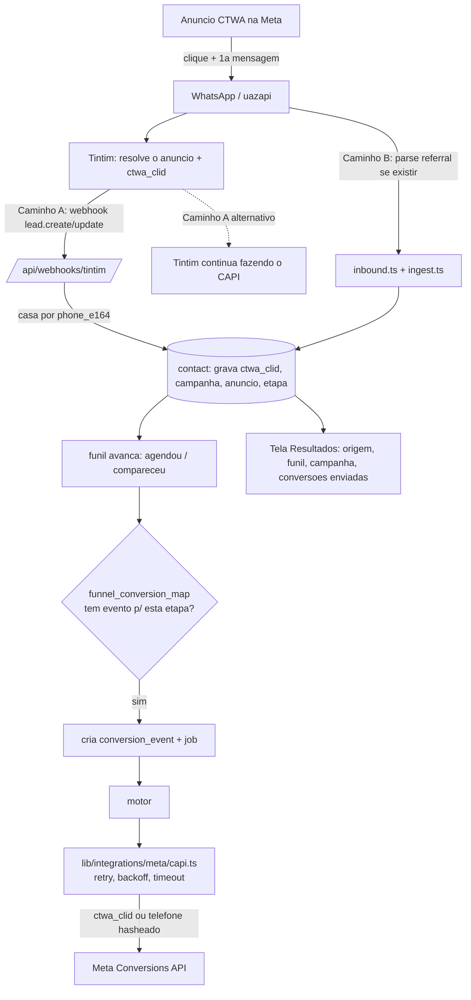

# Resultados: Atribuição de Campanha e Retorno de Conversão para a Meta

### Conduzza Clínicas, handoff e plano de execução

Documento de handoff da parte de **Resultados**: de onde o lead veio, quanto disso comparece, e como devolver essa conversão para a Meta (e opcionalmente Google). Escrito depois de ler o código, o schema e a spec deste repositório, de conferir a documentação da uazapi, e de **entrar no painel do Tintim por dentro** (conta Dra. Ingrid Tavares) para ver a estrutura real e o que ele já envia para o Conduzza.

**Régua de confiança usada aqui:**

- `[OK]` conferido no código, no schema, na spec ou ao vivo no Tintim
- `[PREMISSA]` hipótese de trabalho, a validar com você
- `[PENDENTE]` dado que ainda não existe e precisa ser levantado
- `[DECISÃO]` escolha de produto que é sua, não minha (regra do `CLAUDE.md` seção 7: não invento escopo)

---

## 0. Resumo executivo (leia isto primeiro)

1. **Atribuição já existe no Conduzza**, mas fraca: só por texto (token `#XXXXXX` no link, mensagem padrão ou palavra-chave). Não tem id de campanha da Meta nem `ctwa_clid`.
2. **A tela de Resultados não existe** (é placeholder). Dashboard (5.1) e Relatórios (5.2) estão pendentes na Fase 5. *(Retrato de antes de 08/09: a v1 da tela foi construída junto com este documento, e a `funnel_conversion_map` já está aplicada. O que segue pendente é R2 a R6.)*
3. **Nenhuma integração com a Meta** no código (não há `lib/integrations/meta/`, nem CAPI, nem tabela de eventos). "Retornar conversão para a Meta" é escopo novo, não está em `docs/01` nem `docs/05`.
4. **Descoberta decisiva:** o **Tintim já resolve a atribuição** (campanha, conjunto, anúncio e o `ctwa_clid`) e **já empurra isso para um webhook do Conduzza** (`webhook.conduzza.tech`), casado por telefone. Esse webhook funcionou agosto inteiro e **quebrou em 02/09**. Ou seja, "pegar a campanha de onde o lead veio" **já é possível hoje, via Tintim**, sem depender da uazapi.
5. **Decisão tomada (D0):** **replicar e largar o Tintim** (Caminho B). O `webhook.conduzza.tech` é um **n8n** (confirmado). Isso põe a verificação da uazapi (R0, seção 4) como o **gargalo que destrava tudo**: o retorno de qualidade para a Meta depende do `ctwa_clid` vir da uazapi. O payload do n8n/Tintim (seção 2.2) é a **especificação exata dos campos a capturar**, e o n8n serve de **ponte de migração e backfill** enquanto o Conduzza não captura sozinho. **Risco central em destaque na seção 9.**

---

## 1. O que você pediu

Uma seção de **Resultados** que:

1. mostre de qual campanha cada lead veio, e o que aconteceu com ele (funil), no estilo do Tintim;
2. calcule as métricas por origem/campanha (configurável como no Tintim);
3. **devolva a conversão para a Meta**: quando um lead "compra" (a etapa que a clínica marcar), disparar o evento de volta para a conta de anúncios, para a Meta otimizar e medir o retorno.

> **Aviso de escopo.** Mostrar resultado por campanha e funil já está na spec (`docs/01` Módulo 10) e meio construído. **Devolver a conversão para a Meta (CAPI)** NÃO está em `docs/01` nem `docs/05`: é módulo novo. Pelo `CLAUDE.md` seção 7 eu não construo escopo novo sem seu aval, então ele entra como plano e as decisões ficam marcadas `[DECISÃO]`.

---

## 2. Descoberta decisiva: o Tintim já entrega a atribuição para o Conduzza

Entrei no painel do Tintim ao vivo. O mais importante não estava nos prints: **o Tintim já resolve o anúncio de origem e já dispara isso para um endpoint do Conduzza.**

### 2.1 O webhook Tintim -> Conduzza (existe, e quebrou em 02/09) `[OK]`

Em **Informações do Cliente > Webhooks** há um webhook apontando para:

```
https://webhook.conduzza.tech/webhook/<slug-da-cliente>
```

com quatro gatilhos: **Criação de Conversa, Alteração de Conversa, Criação de Mensagem, Alteração da Origem da Conversa**. O log (**Disparos de Webhook**) mostra o evento `novo lead` sendo entregue **com sucesso durante agosto inteiro** e **começando a falhar em 02/09/2026**, o que desativou os disparos (é a faixa amarela "webhooks desativados" que aparece em todas as telas).

`webhook.conduzza.tech` **não é** o app Conduzza Clínicas deste repositório: as únicas rotas de webhook aqui são `/api/webhooks/whatsapp` e `/api/webhooks/motor`, e não há **nenhuma** referência a Tintim no código (só o valor `anuncio_ctwa` no enum de consentimento). Pelo padrão da URL (`/webhook/<nome>`), é quase certo que seja um **n8n** ou serviço separado. `[PREMISSA]` Confirmar onde esse endpoint vive hoje e o que ele faz com o dado.

### 2.2 O payload que o Tintim manda (evento `lead.create`) `[OK]`

Abri um disparo real e li o corpo. Esquema (contato redigido, valores de exemplo):

```json
{
  "event_type": "lead.create",
  "account": { "code": "<accountCode>", "name": "<clinica>" },
  "ctwa_clid": "<id do clique no anuncio CTWA>",
  "source": "Meta Ads",
  "ad": {
    "ad_account_id": "act_...", "ad_account_name": "...",
    "campaign_id": "...", "campaign_name": "...",
    "adset_id": "...", "adset_name": "...",
    "ad_id": "...", "ad_name": "...",
    "campaign_status": "ACTIVE", "is_active": true,
    "last_sync": "...", "amount_spent": null, "code": null,
    "message": null, "message_encoded": null, "uid": null
  },
  "name": "<redigido>", "phone": "<redigido>", "phone_e164": "<redigido>",
  "status": { "id": 0, "name": "<etapa da jornada>" },
  "sale_amount": 0, "sale_amount_from_message": 0, "accumulated_value": 0,
  "location": { "country": "...", "state": "..." },
  "first_interaction_at": "...", "first_response_at": null,
  "first_response_status": null, "last_interaction_at": "...",
  "journey_time": null, "total_messages": 0, "visit": null,
  "created": "...", "updated": "..."
}
```

O que importa:

- **`ctwa_clid` vem preenchido.** É a chave de ouro do CAPI: o Tintim captura o clique do anúncio e repassa. Isso resolve, do lado deles, o problema que a uazapi não garante.
- **Atribuição Meta completa:** campanha, conjunto e anúncio (id + nome) e conta de anúncio.
- **`phone_e164`:** a chave para casar com `contact.phone_e164` do Conduzza.
- **`status`:** a etapa da jornada (o evento de alteração reflete a mudança de etapa).
- **`sale_amount` / `accumulated_value`:** valor da conversão.
- **Métricas de conversa:** `first_interaction_at`, `first_response_at`, `journey_time`, `total_messages`, que alimentam o "tempo de 1ª resposta" e "tempo de jornada" do dashboard.

**Consequência:** a pergunta "dá pra pegar a campanha de onde o lead veio?" tem resposta **sim, e sem depender da uazapi**, contanto que o Conduzza consuma esse webhook. A investigação da uazapi (seção 4) só volta a ser necessária se a decisão for **largar o Tintim**.

### 2.3 A decisão-mãe: integrar ou replicar `[DECISÃO]` (D0)

- **Caminho A, integrar com o Tintim.** O Conduzza ganha uma rota que consome `lead.create` / `lead.update`, casa por `phone_e164`, grava `ctwa_clid` + campanha/conjunto/anúncio + etapa no `contact`, e monta Resultados a partir disso. O retorno para a Meta pode **continuar no Tintim** ou passar a ser feito pelo Conduzza usando o `ctwa_clid` que o Tintim entrega. Menor esforço, maior qualidade de dado, reaproveita o que já funcionava. Mantém a dependência e o custo do Tintim por conta.
- **Caminho B, replicar e largar o Tintim.** O Conduzza captura a atribuição sozinho (precisa do referral da uazapi, a verificação R0), constrói o mapa jornada->Meta e o CAPI próprio, e dispensa o Tintim. Mais trabalho, tira o custo/dependência, mas depende do R0 dar positivo.
- **Caminho C, híbrido.** Integrar agora (A) para destravar Resultados imediatamente com dado real, e em paralelo rodar o R0 para, se der certo, migrar para o B e largar o Tintim sem pressa.

> **Decisão do dono (08/09): Caminho B, replicar e largar o Tintim.** `webhook.conduzza.tech` confirmado como **n8n**. A partir daqui o plano prioriza B. O n8n/Tintim vira **ponte temporária**: enquanto o Conduzza não captura sozinho, ele ainda é a fonte do `ctwa_clid` e da campanha, e o payload da seção 2.2 é a lista exata de campos a reproduzir. **O primeiro passo é o R0** (a uazapi entrega o `ctwa_clid`?), porque é ele que decide se o B tem qualidade máxima ou cai para casamento por telefone. Ver o risco central na seção 9.

### 2.4 Estrutura interna do Tintim, confirmada ao vivo (para replicar, caminhos B/C) `[OK]`

- **Jornada de Compra > editar etapa:** campos reais `name`, `conversions` (o evento Meta, escolhido de um catálogo de 17), `is_sales` (checkbox), `is_first_contact` (checkbox), `default_value` (valor monetário da etapa) e termo-chave. Confirma o `funnel_conversion_map` proposto e sugere acrescentar `is_first_contact`.
- **Eventos de Conversão:** catálogo por conta dos 17 eventos padrão da Meta (ViewContent, Lead, Purchase, Contact, Schedule, InitiateCheckout, AddToCart, CompleteRegistration, ...), com "Adicionar Novo Evento" para eventos custom.
- **Disparos de Eventos:** log dos últimos 50 eventos enviados, filtrável por Meta Ads / Google Ads. (Nesta conta está vazio, porque o Meta Ads não está conectado aqui.)
- **Links Rastreáveis:** links com código UUID que passam pelo Tintim (redirect) para capturar o clique. Mecanismo diferente do `#token` do Conduzza, mesmo objetivo.
- **Mensagens Rastreáveis:** equivalente para Google Ads.
- **Inspetor de Vendas (LUPA IA, beta, 500 conversas/mês):** a IA lê as conversas e lista as que têm evidência de venda, com nível de confiança e o trecho de evidência, para o operador aprovar ("Aprovar todos"). É o que fecha a lacuna das conversões não rastreadas (o "219 possíveis conversões" do dashboard). Equivalente no Conduzza seria a Fase 3 (agente de IA), hoje adiada.
- **Relatórios:** gerador assíncrono de exportações: Conversas, **Conversões Offline com GCLID** (importação de conversão do Google, o GCLID é o equivalente Google do `ctwa_clid`), Histórico de Alterações da Jornada, Histórico de Vendas.
- **Meta Ads (config):** Pixel do Meta Ads, "Disparar Pixel para conversas não rastreadas" (Sim/Não), Token de Conversão da API (CAPI), Contas de Anúncio Associadas. **Google Ads** por OAuth.

---

## 3. Onde o sistema (Conduzza Clínicas) está hoje

### 3.1 Atribuição de origem: existe, e é determinística `[OK]`

O Conduzza **já captura** a origem, sem depender da Meta, em três lugares:

| Peça | Arquivo | O que faz |
|---|---|---|
| Decisão pura | `lib/domain/attribution.ts` | `atribuirOrigem(corpo, regras)`, sem I/O, testável |
| Orquestração | `lib/integrations/whatsapp/ingest.ts` | busca `campaign_link`, roda a atribuição, grava em `contact.source_*` |
| Configuração | tabela `campaign_link` (migration `20260825100000_funil_atribuicao_e_pacotes.sql`) | uma linha por campanha |

Três mecanismos determinísticos, em ordem de precedência: **token do link** (`#XXXXXX` que casa com `campaign_link.token`), **mensagem padrão** (corpo igual ao `default_message`), **palavra-chave**. Grava em `contact.source_channel/origin/medium/campaign/method/captured_at`, e o trigger `impedir_reatribuicao_de_origem` congela a origem depois de capturada. Taxonomia: os 8 canais do padrão HubSpot (spec 10.2).

**Limite:** entrega o nome da campanha que **você** cadastrou, não o id de campanha/anúncio da Meta, e **não guarda `ctwa_clid`**. É o caminho fraco para devolver conversão à Meta. (O Tintim, seção 2, resolve isso melhor.)

### 3.2 Funil: existe, e avança sozinho `[OK]`

`contact.funnel_stage`: `novo`, `em_contato`, `aguardando_resposta`, `agendou`, `compareceu`, `perdido`. Dois triggers avançam sozinhos (migration `20260825100000`): criar `appointment` -> `agendou`; `appointment.status = 'compareceu'` -> `compareceu`. **É o gancho natural do disparo de conversão para a Meta.**

### 3.3 Canal WhatsApp (uazapi): funciona, mas o parser descarta o anúncio `[OK]`

- Cliente: `lib/integrations/whatsapp/uazapi.ts`. Webhook nos eventos `["messages","messages_update","connection"]`.
- Rota: `app/api/webhooks/whatsapp/route.ts`. Parser: `lib/integrations/whatsapp/inbound.ts`.
- **Ponto crítico:** o `uazapiSchema` lê texto, mídia, citação, botões e reações. **Não lê nenhum campo de anúncio** (`referral`, `ctwa_clid`, `contextInfo`). O schema é `.loose()`, então esses campos, se vierem, passam mas são ignorados.

### 3.4 Tela de Resultados: não existe `[OK]` *(retrato de antes de 08/09; a v1 existe desde o commit que criou este documento)*

`app/(app)/relatorios/page.tsx` é um placeholder (`ModulePlaceholder`); o `loading.tsx` já tem o esqueleto certo (4 cartões, gráfico, tabela). No backlog, a Fase 5 está toda pendente: `5.1 Dashboard`, `5.2 Relatórios`, `5.3 Configurações`. A spec do conteúdo está em `docs/01` Módulo 10; o layout em `docs/02` Telas 5 e 11.

### 3.5 Integração com a Meta: não existe no código `[OK]`

`lib/integrations/` tem `whatsapp/`, `billing/` (vazio) e `llm/` (vazio). Não há `meta/`, nem tabela de conta de anúncios, Pixel, token CAPI ou eventos de conversão. Tudo que for "devolver para a Meta" é construção do zero (a menos que fique no Tintim, Caminho A).

---

## 4. A uazapi captura a campanha? (só importa no Caminho B)

> Se a escolha for **integrar** (Caminho A), pule esta seção: a atribuição e o `ctwa_clid` vêm prontos do Tintim. Esta seção só importa para **largar o Tintim** (Caminho B).

O referral do CTWA (com `ctwa_clid`, `source_id` do anúncio, `source_url`) viaja dentro do `contextInfo` da mensagem do WhatsApp. A **OpenAPI da uazapi não documenta** esse campo; ela tem um `content` genérico (payload cru) e `contextInfo` não detalhado. APIs não oficiais da mesma família (Baileys/whatsmeow) têm histórico de **derrubar** o referral. Então, só pela documentação, **não dá para garantir** que a uazapi entrega o `ctwa_clid`.

**R0, a verificação que responde isso:** capturar um payload real de uma mensagem vinda de um anúncio CTWA de verdade, na instância uazapi de vocês, e procurar no corpo por `ctwaClid`/`ctwa_clid`/`externalAdReply`/`sourceId`. Como fazer: logar o `payload` bruto uma única vez em ambiente de teste, antes do `parseInboundEvent`, ou apontar um webhook de teste (webhook.site) numa instância de laboratório. Se aparecer, o Caminho B fica viável com qualidade máxima; se não, o retorno à Meta pelo Conduzza teria que casar por PII (telefone com hash), mais fraco.

Fontes: uazapi (<https://docs.uazapi.com/>); referral/`ctwa_clid` ([WATI](https://www.wati.io/en/blog/set-up-click-to-whatsapp-ads/), [whapi.cloud](https://whapi.cloud/blog/track-click-to-whatsapp-ctwa-clid), [metricfixer](https://metricfixer.com/publications/analytics-conversion-tracking/track-click-to-whatsapp-ads-campaign-ad-creative-without-website)); referral derrubado em API não oficial ([Evolution API #2645](https://github.com/evolution-foundation/evolution-api/issues/2645)).

---

## 5. Modelo de dados proposto

Padrão do projeto: tabela de negócio nasce com `clinic_id not null`, RLS e policy na mesma migration; segredo em tabela irmã só-service-role. `[PREMISSA]` nos nomes.

### 5.1 Ingestão do Tintim (Caminho A)

```sql
-- Guarda o que o webhook do Tintim entrega, casado ao contato por phone_e164.
-- Melhor esforço: nunca bloqueia; origem imutável continua valendo.
alter table contact add column ctwa_clid text;
alter table contact add column source_ad_id text;
alter table contact add column source_adset_id text;
alter table contact add column source_campaign_id text;   -- id numerico da Meta
-- source_campaign (nome) e os demais source_* ja existem.

-- Log cru dos eventos recebidos do Tintim, para idempotencia e auditoria.
create table tintim_event (
  id uuid primary key default gen_random_uuid(),
  clinic_id uuid not null references clinic(id) on delete cascade,
  event_type text not null,            -- lead.create | lead.update | ...
  external_ref text,                   -- id/hash do disparo, para idempotencia
  phone_e164 text,
  payload jsonb not null,              -- SEM conteudo de conversa de paciente
  processed_at timestamptz,
  created_at timestamptz not null default now(),
  unique (clinic_id, external_ref)
);
```

### 5.2 Mapa de conversão (o "Jornada de Compra" do Conduzza), caminhos B/C

```sql
create table funnel_conversion_map (
  id uuid primary key default gen_random_uuid(),
  clinic_id uuid not null references clinic(id) on delete cascade,
  trigger_stage text not null check (trigger_stage in
    ('novo','em_contato','aguardando_resposta','agendou','compareceu')),
  meta_event_name text not null,          -- Lead | Schedule | Contact | Purchase | ...
  is_sale boolean not null default false, -- is_sales do Tintim
  is_first_contact boolean not null default false,
  value_source text check (value_source in ('service_link','fixo')),
  value_cents integer,                    -- default_value do Tintim
  active boolean not null default true,
  created_at timestamptz not null default now(),
  updated_at timestamptz not null default now(),
  unique (clinic_id, trigger_stage)
);
```

### 5.3 Conta de anúncios e segredo (só se o CAPI for feito no Conduzza)

```sql
create table meta_ads_account (
  clinic_id uuid primary key references clinic(id) on delete cascade,
  enabled boolean not null default false,
  pixel_id text, ad_account_id text, business_id text,
  send_unmatched boolean not null default true,   -- "disparar p/ conversas nao rastreadas"
  test_event_code text,
  created_at timestamptz not null default now(),
  updated_at timestamptz not null default now()
);
create table meta_ads_account_secret (            -- RLS sem policy, so service role
  clinic_id uuid primary key references clinic(id) on delete cascade,
  capi_access_token text,
  created_at timestamptz not null default now(),
  updated_at timestamptz not null default now()
);
```

### 5.4 Registro de conversões enviadas (auditoria + idempotência)

```sql
create table conversion_event (
  id uuid primary key default gen_random_uuid(),
  clinic_id uuid not null references clinic(id) on delete cascade,
  contact_id uuid not null references contact(id) on delete cascade,
  appointment_id uuid references appointment(id),
  destination text not null default 'meta' check (destination in ('meta','google','tintim')),
  meta_event_name text not null,
  event_id text not null,                 -- idempotencia ponta a ponta
  event_time timestamptz not null,
  value_cents integer, currency text not null default 'BRL',
  match_type text not null default 'ctwa' check (match_type in ('ctwa','pii','none')),
  ctwa_clid text,
  status text not null default 'pendente' check (status in ('pendente','enviado','erro','ignorado')),
  provider_response jsonb, attempts integer not null default 0,
  created_at timestamptz not null default now(),
  updated_at timestamptz not null default now(),
  unique (clinic_id, event_id)
);
```

Fila: reusar `job_queue` com `kind = 'enviar_conversao_meta'`, executada pelo motor (`/api/webhooks/motor`, pg_cron a cada 20s). Nunca disparar CAPI no caminho do webhook.

---

## 6. Fluxo ponta a ponta (proposto)



---

## 7. Plano de execução

Cada tarefa fecha pela Definição de Pronto do `CLAUDE.md` seção 6 (build/typecheck/lint, RLS testada A não lê B, estados vazio/carregando/erro, claro e escuro, nenhum dado de paciente em log, sem travessão na interface).

> Decisão: **Caminho B**. O bloqueador é o **R0** (a uazapi entrega o `ctwa_clid`?). **RA1/RA2** viram **opcionais, ponte de migração** (consumir o n8n/Tintim para não ficar sem atribuição enquanto o R0 não fecha). **R0/R1 + R2 a R6** são o núcleo do B.

### RA1. Receber o webhook do Tintim `M` (destrava tudo, Caminho A)
- Rota `/api/webhooks/tintim` no padrão de `/api/webhooks/whatsapp`: segredo por clínica na URL, idempotente (`tintim_event.external_ref`), responde rápido.
- Casar por `phone_e164` com `contact`; gravar `ctwa_clid`, `source_campaign_id/adset/ad` (id + nome) e canal, como melhor esforço, respeitando o trigger de origem imutável.
- Mapear `event_type` (`lead.create`/`lead.update`) e `status` (etapa) para o funil.
- **Aceite:** um `lead.create` de teste cria/atualiza o contato com a campanha e o `ctwa_clid`; reentrega não duplica; RLS isola clínicas.

### RA2. Religar o webhook no Tintim `P`
- Corrigir o endereço no Tintim e reativar os disparos (desativados desde 02/09). Decidir se `webhook.conduzza.tech` (provável n8n) continua no meio ou se o Tintim chama o app direto.
- **Aceite:** disparos voltam a "processado com sucesso" e chegam ao Conduzza. `[PENDENTE]` mapear o que o n8n faz hoje com esse payload.

### R0. Verificar o referral da uazapi `[PENDENTE]` (Caminho B, ver seção 4)
Capturar payload real de anúncio CTWA e ver se tem `ctwa_clid`. Sem código de produção.

### R1. Persistir o referral da uazapi `P` (Caminho B, se R0 der positivo)
Estender `inbound.ts` + `ingest.ts` para extrair e gravar `ctwa_clid` e ids do anúncio no nascimento do contato.

### R2. Mapa de conversão por clínica `M` (o "Jornada" configurável, como você pediu)
Migration `funnel_conversion_map` + tela: por etapa do funil, escolher o evento Meta, marcar "é venda" e "primeiro contato", definir valor (fixo ou preço da consulta). Espelha a edição de etapa do Tintim.

### R3. Integração Meta CAPI `G` (só se o retorno for feito no Conduzza)
`lib/integrations/meta/capi.ts` no padrão adaptador (retry, backoff, timeout, server-only). Payload com `event_name`, `event_time`, `event_id`, `user_data` (telefone SHA-256) e `ctwa_clid` quando houver, `custom_data.value`/`currency` na venda. `test_event_code` para validar no Gerenciador de Eventos. Migrations `meta_ads_account` + secret.

### R4. Disparo automático nos gatilhos do funil `M`
Ao avançar para etapa mapeada, criar `conversion_event` e enfileirar `enviar_conversao_meta`. Idempotente por `event_id`.

### R5. Tela Resultados (Dashboard 5.1 + Relatórios 5.2) `G`
Implementar `app/(app)/relatorios` seguindo Módulo 10 e Telas 5/11: 4 indicadores (Leads, Agendamentos, Comparecimentos, Taxa lead->comparecimento), funil visual, origem por canal em **barras horizontais** (proibido pizza/rosca/empilhada/medidor/3D), tabela por campanha, desempenho da IA, custo, comparação com período anterior, exportação CSV/PDF. **Painel novo:** "Conversões devolvidas à Meta" (quantas, valor, casadas por `ctwa_clid` vs PII, erros), lendo `conversion_event`.

### R6. Configurações da Meta `M`
Aba para `pixel_id`, `ad_account_id`, `capi_access_token`, `test_event_code`, interruptor `send_unmatched`. Só admin/gestor; token só na tabela-secret.

**Ordem sugerida (Caminho B):** **R0 primeiro** (decide a viabilidade). Em paralelo, R2 e R5 (mapa de conversão e tela de Resultados, que não dependem do R0). Se R0 der positivo: R1 -> R3 -> R4 -> R6. Ponte opcional enquanto isso: RA1, para não perder a atribuição que ainda vem do Tintim. Quando o Conduzza capturar e disparar sozinho, desligar o n8n e o Tintim.

---

## 8. Decisões que são suas `[DECISÃO]`

- **D0. RESPONDIDO: replicar e largar o Tintim (Caminho B).** Isso põe o R0 (uazapi) como primeiro passo e faz do n8n/Tintim uma ponte temporária de migração.
- **D1. "Retornar conversão para a Meta" vira módulo aprovado?** Não está em `docs/01` nem `docs/05`. Se sim, registro na spec e no backlog. (No Caminho A puro, quem retorna é o Tintim, e isso vira "não construir agora".)
- **D2. O que conta como "comprou"? RESPONDIDO por você: configurável, igual ao Tintim.** Fica no `funnel_conversion_map` (por clínica, por etapa). O default que semeio é sugestão, não regra: `agendou -> Schedule`, `compareceu -> Purchase` (valor = preço da consulta).
- **D3. Se largar o Tintim (B):** rodar o R0 antes, porque o CAPI de qualidade depende do `ctwa_clid` vir da uazapi.
- **D4. Google Ads também**, ou só Meta? (O Tintim tem os dois, com conversão offline por GCLID.)
- **D5. RESPONDIDO: `webhook.conduzza.tech` é um n8n.** `[PENDENTE]` ainda: o que o fluxo n8n faz hoje com o `lead.create` (só reencaminha, grava em banco, aciona o sistema atual?). Isso decide se ele vira a ponte de migração ou é aposentado direto.
- **D6. Base legal LGPD** para enviar telefone (hasheado) à Meta: conversa de paciente é dado sensível. Recomendo só enviar conversão de contato com consentimento ativo, só telefone hasheado + evento + valor, nunca conteúdo de conversa.

---

## 9. Riscos e conformidade

- **O risco central do Caminho B (leia antes de desligar o Tintim):** o Tintim quase certamente captura o `ctwa_clid` pela **API oficial da Meta** (WhatsApp Business Platform). A uazapi é **não oficial**. Ao largar o Tintim e depender só da uazapi, você perde a captura oficial e passa a depender de a uazapi entregar o referral (R0). Se ela não entregar, largar o Tintim custa a atribuição em nível de `ctwa_clid`, e o retorno à Meta cai para o casamento por telefone (PII), mais fraco. Some-se a isso que Tintim (oficial) e Conduzza (uazapi) dificilmente ficam no mesmo número ao mesmo tempo: a migração do número precisa ser planejada. **Faça o R0 antes de desligar o Tintim.**
- **LGPD (o mais sério):** retorno de conversão envia telefone (hasheado) e um evento de compra à Meta, compartilhamento de dado pessoal com terceiro. Exige base legal, minimização e transparência (ver D6).
- **Dependência frágil (Caminho A):** o webhook do Tintim quebrou sozinho em 02/09 e ninguém percebeu até a faixa amarela. Se o Conduzza passar a depender dele, precisa de **monitoramento** (alerta quando parar de chegar `lead.create`).
- **Qualidade do match:** com `ctwa_clid`, match forte, mas há janela de validade (mandar a conversão rápido). Sem ele, casa por telefone, mais fraco.
- **Idempotência:** conversão duplicada polui a otimização e o valor. Trava por `event_id` + unique de `conversion_event` + `tintim_event.external_ref`.
- **uazapi:** risco de banimento do número não muda; e o referral não é garantido (por isso o Caminho A é mais seguro para atribuição).

---

## 10. Referências no repositório

| Assunto | Onde |
|---|---|
| Regras do projeto | `CLAUDE.md` (3.1 LGPD, 3.3 canal, 4 integrações, 5 interface, 6 pronto, 7 escopo) |
| Atribuição (lógica / orquestração) | `lib/domain/attribution.ts`, `lib/integrations/whatsapp/ingest.ts` |
| Parser e rota do webhook uazapi | `lib/integrations/whatsapp/inbound.ts`, `app/api/webhooks/whatsapp/route.ts` |
| Schema atribuição/funil | `supabase/migrations/20260825100000_funil_atribuicao_e_pacotes.sql` |
| Schema contato/conversa | `supabase/migrations/20260819190000_conversas_whatsapp.sql` |
| Modelo de dados | `docs/04_modelo_dados.md` |
| Spec da tela | `docs/01_...` Módulo 10; layout `docs/02_...` Telas 5 e 11 |
| Backlog Fase 5 | `docs/05_backlog.md` (5.1, 5.2, 5.3 pendentes) |
| Motor assíncrono | `supabase/operacao/motor-por-cron.md` |

**Tintim (para referência, exige login):** Jornada `.../leadstatus`, Eventos de Conversão `.../conversions`, Disparos de Eventos `.../events`, Links Rastreáveis `.../campaigns`, Inspetor de Vendas `.../identified-conversions`, Relatórios `.../reports`, Informações do Cliente e Webhooks `/instances/.../view`.

---

*Handoff atualizado em 08/09/2026 após explorar o Tintim por dentro. Nenhum dado de paciente (nome, telefone, conversa) foi copiado para este documento. As partes `[DECISÃO]` e `[PENDENTE]` precisam de você antes de virar código.*
